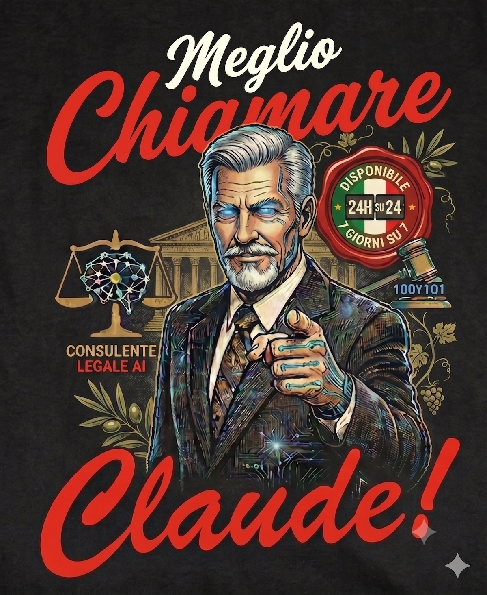
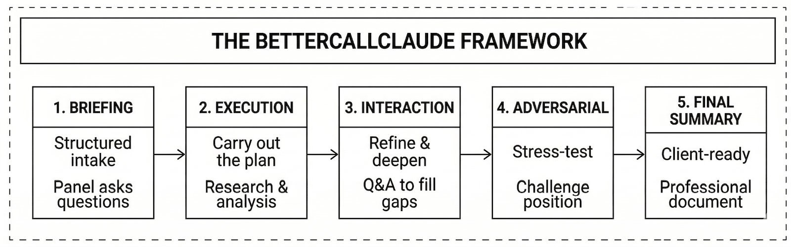

[](https://github.com/fedec65/bettercallclaude_italia/releases)
[](LICENSE)
[](https://claude.ai)
[](https://buymeacoffee.com/federicocesconi)

<p align="center">
  
</p>

<p align="center"><strong>Plugin di Intelligenza Legale Italiana per Cowork Desktop</strong></p>

BetterCallClaude Italia trasforma la ricerca legale, la strategia di causa e la redazione documentale per gli avvocati italiani. Offre integrazione profonda con banche dati giuridiche italiane, analisi bilingue (IT/EN) e assistenza al rilevamento del segreto professionale — 21 agenti, 30 comandi, 17 skill e 9 server MCP che coprono ricerca sui precedenti della Cassazione, strategia processuale, analisi avversariale, redazione legale, calcolo dei termini processuali, verifica delle citazioni (`legal-persona-ita_compute_deadlines`, `citation-verify-ita_check_existence`), flussi di lavoro personalizzati, mappe decisionali per pratiche grandi e intelligenza documentale in tutte le 20 regioni italiane.

---

## Novità della v2.2.0

- **Flussi di lavoro personalizzati** — Nuovo comando `/crea-flusso`: progetta via intervista una pipeline riutilizzabile combinando gli agenti del plugin, la valida lato server e la salva. `/flusso` elenca ed esegue anche i tuoi flussi salvati accanto ai template predefiniti.
- **Nuovo server MCP `workflows-ita`** (9° server) — 8 tool: `list_agents`, `validate_pipeline`, `save_workflow`, `list_workflows`, `get_workflow`, `delete_workflow`, `claim_user_id`, `log_run`. Se il server non è raggiungibile, il plugin degrada con grazia: i flussi salvati vengono semplicemente omessi.
- **User ID personale** — Nuova impostazione `userConfig.user_id`: ogni utente ha un namespace univoco per i propri flussi, senza fallback su un `default` condiviso. Se non configurato, il plugin genera un ID `bcc-…` con claim di univocità lato server e lo rende durevole via istruzioni personalizzate Cowork.

---

## User ID per i flussi personalizzati

I flussi che crei con `/crea-flusso` sono salvati sul server `workflows-ita` sotto un **User ID personale**: è quell'ID a determinare quali flussi vedi in `/flusso`. Non serve configurarlo per iniziare — ma va reso permanente per non perdere l'accesso ai flussi.

### Come funziona senza configurazione

Al primo uso di `/crea-flusso` o `/flusso`, se non trova nessun ID configurato, il plugin:

1. Genera un ID casuale della forma `bcc-<16 caratteri esadecimali>`
2. Ne verifica l'univocità sul server (`claim_user_id`)
3. Lo salva in `~/.betterask/config.yaml` e te lo comunica una sola volta

**Attenzione**: Cowork Desktop svuota la home della sandbox a ogni riavvio, quindi il file di config viene cancellato. Senza una configurazione permanente, al riavvio verrebbe generato un **nuovo** ID — e i flussi salvati sotto il vecchio ID non apparirebbero più (non sono persi: restano sul server, ma sotto l'ID precedente).

### Configurazione permanente (consigliata)

Scegli **una** di queste due opzioni:

- **Cowork Desktop** — Vai in **Impostazioni → Generali → Istruzioni per Claude** e aggiungi una riga:
  ```
  BetterCallClaude workflow user ID: bcc-il-tuo-id
  ```
  Se hai già usato i flussi, riusa l'ID generato (te lo ha comunicato il plugin alla prima creazione) per ritrovare i tuoi flussi esistenti.
- **Claude CLI** — Apri le impostazioni del plugin e valorizza **"User ID per i flussi personalizzati"** (`userConfig.user_id`) con lo stesso ID.

### Ordine di risoluzione

Quando servono i tool dei flussi, il plugin cerca l'ID in quest'ordine e usa il primo che trova:

1. Impostazione del plugin (`userConfig.user_id`)
2. Riga `BetterCallClaude workflow user ID: …` nelle istruzioni personalizzate Cowork
3. File `~/.betterask/config.yaml` (cache di comodo, cancellata al riavvio di Cowork)
4. Generazione automatica di un nuovo ID (con claim di univocità lato server)

### Stesso ID su più macchine

Per usare gli stessi flussi su due computer, configura **lo stesso ID** su entrambi. Alla prima operazione sul secondo computer potresti vedere l'avviso "Questo User ID è già registrato sul server": è normale — significa che il namespace esiste già (l'hai creato tu dall'altra macchina) e puoi ignorarlo.

### Privacy dell'ID

L'ID è self-asserted: il server non verifica l'identità, quindi **chiunque conosca il tuo ID può leggere i tuoi flussi**. Trattalo come un segreto leggero: non pubblicarlo. I flussi contengono definizioni di pipeline (agenti, passi, formato dell'output), non dati delle tue cause. Se sospetti che l'ID sia stato esposto, cambialo nelle impostazioni e ricrea i flussi sotto il nuovo ID.

---

## Panoramica

BetterCallClaude Italia fornisce una metodologia strutturata per gestire il lavoro legale con assistenza AI. Il framework è costituito da cinque fasi interconnesse.

<p align="center">
  
</p>

---

## Installazione

1. In Cowork, clicca **Personalizza** > **Sfoglia plugin** > **Personali** > **+** > **Aggiungi marketplace da GitHub**
2. Inserisci `fedec65/bettercallclaude_italia` e clicca **Sincronizza**
3. Clicca **Installa** sulla scheda BetterCallClaude Italia

I server MCP si connettono automaticamente via HTTP. Nessun Node.js, nessuna configurazione locale, nessuna chiave API richiesta.

> **[QUI L'INSTALLAZIONE PASSO PER PASSO](docs/INSTALLAZIONE.md)** -- Guida illustrata con screenshot per ogni passaggio.

---

## Comandi

| Comando | Descrizione |
|---------|-------------|
| `/bettercallclaude-italia:legale` | Gateway intelligente — analizza intento, indirizza a specialisti |
| `/bettercallclaude-italia:legale-5step` | Pipeline completa a 5 fasi: intake → ricerca → strategia → contraddittorio → redazione |
| `/bettercallclaude-italia:legale-obiettivo` | Definisce condizione di successo legale verificabile (Goal Record) |
| `/bettercallclaude-italia:legale-loop` | Esegue ciclo worker-valutatore contro un Goal Record |
| `/bettercallclaude-italia:mappa-legale` | Traccia una pratica grande come mappa decisionale wayfinder |
| `/bettercallclaude-italia:percorso-legale` | Lavora un ticket decisionale di una mappa wayfinder |
| `/bettercallclaude-italia:raffina` | Trasforma query legali vaghe in prompt strutturati |
| `/bettercallclaude-italia:ricerca` | Cerca precedenti giuridici italiani e compila memorie di ricerca |
| `/bettercallclaude-italia:strategia` | Sviluppa strategia processuale con valutazione del rischio |
| `/bettercallclaude-italia:redazione` | Redige documenti legali italiani con corretta formattazione delle citazioni |
| `/bettercallclaude-italia:citazione` | Verifica e formatta citazioni giuridiche italiane |
| `/bettercallclaude-italia:verifica` | Valida citazioni giuridiche italiane in bulk |
| `/bettercallclaude-italia:precedente` | Cerca e analizza precedenti della Cassazione |
| `/bettercallclaude-italia:nazionale` | Analizza secondo il diritto nazionale italiano |
| `/bettercallclaude-italia:regionale` | Analizza secondo il diritto regionale per una regione specifica |
| `/bettercallclaude-italia:contraddittorio` | Esegue analisi avversariale a tre agenti |
| `/bettercallclaude-italia:briefing` | Briefing strutturato pre-esecuzione |
| `/bettercallclaude-italia:flusso` | Definisce ed esegue workflow legali multi-agente (inclusi i flussi salvati) |
| `/bettercallclaude-italia:crea-flusso` | Crea un flusso di lavoro personalizzato riutilizzabile combinando gli agenti del plugin |
| `/bettercallclaude-italia:traduci` | Traduce documenti legali IT/EN |
| `/bettercallclaude-italia:analisi-doc` | Analizza documenti legali |
| `/bettercallclaude-italia:triage-nda` | Triage NDA: classifica GREEN/YELLOW/RED secondo diritto italiano |
| `/bettercallclaude-italia:riassumi` | Consolida output delle pipeline multi-agente |
| `/bettercallclaude-italia:start` | Onboarding — verifica MCP, guida playbook, esempi d'uso |
| `/bettercallclaude-italia:doctor` | Diagnostica server MCP con guida contestuale |
| `/bettercallclaude-italia:configurazione` | Alias per /start (deprecato) |
| `/bettercallclaude-italia:privacy` | Visualizza e cambia la modalita privacy del segreto professionale |
| `/bettercallclaude-italia:versione` | Visualizza versione plugin e stato sistema |
| `/bettercallclaude-italia:aiuto` | Mostra il riferimento completo dei comandi |

### Esempi d'Uso

```
/bettercallclaude-italia:legale Voglio valutare la mia esposizione ai sensi dell'art. 1218 CC

/bettercallclaude-italia:raffina Ho problemi con il mio locatore

/bettercallclaude-italia:ricerca Art. 1218 CC responsabilità contrattuale

/bettercallclaude-italia:strategia Contenzioso locativo a Milano, locatore chiede EUR 200k danni

/bettercallclaude-italia:redazione Contratto di lavoro per ingegnere software a Roma

/bettercallclaude-italia:contraddittorio La clausola di non concorrenza è valida?

/bettercallclaude-italia:flusso litigation-prep Risarcimento danni contro produttore

/bettercallclaude-italia:crea-flusso Pipeline personalizzata: ricerca → strategia → redazione

/bettercallclaude-italia:briefing Prepara lite completa per inadempimento art. 1218 CC, EUR 500K

/bettercallclaude-italia:regionale LOM Giurisdizione Tribunale delle Imprese

/bettercallclaude-italia:legale-5step Analisi completa responsabilità contrattuale art. 1218 CC, EUR 300k

/bettercallclaude-italia:analisi-doc @contratto.pdf Analizza questo contratto di locazione
```

---

## Funzionalità Chiave

- **Sessioni di briefing** — Query complesse attivano intake collaborativo con panel di specialisti.
- **Mappe decisionali (wayfinder)** — Pratiche troppo grandi o troppo nebbiose per un piano statico vengono tracciate come mappa decisionale (`/mappa-legale`) e lavorate un ticket alla volta (`/percorso-legale`) fino all'handoff all'esecuzione.
- **Analisi avversariale** — Workflow a tre agenti: l'avvocato costruisce, l'avversario sfida, l'analista giudiziario sintetizza.
- **Workflow multi-agente** — Pipeline predefinite per due diligence, preparazione contenzioso, ciclo contrattuale, closing immobiliare, più flussi personalizzati creati con `/crea-flusso` ed eseguiti con `/flusso`.
- **Tutte le 20 regioni** — Copertura regionale completa con sistemi giudiziari, formati di citazione e ricerca MCP.
- **Bilingue** — Rilevamento automatico della lingua per IT/EN con corretta terminologia legale.
- **Onboarding guidato** — `/start` verifica la connettivita MCP e guida la creazione del playbook locale.
- **Triage NDA** — Classificazione automatica GREEN/YELLOW/RED secondo criteri del diritto italiano.
- **Goal-loop** — Ciclo iterativo worker-valutatore con separazione dei ruoli e quality gates MCP.
- **Output-as-file** — Risultati lunghi salvati in `bcc-output/`, in chat solo un riassunto.
- **Playbook locale** — Personalizzazione posizioni contrattuali, soglie di rischio, formato output per studio.

---

## Server MCP

Tutti i server si connettono automaticamente dopo l'installazione. Nessuna configurazione richiesta.

| Server | Scopo | Trasporto |
|--------|-------|-----------|
| `normattiva` | Legislazione italiana (1861–oggi) | HTTP |
| `corte-costituzionale` | Sentenze Corte Costituzionale | HTTP |
| `giustizia-amministrativa` | TAR e Consiglio di Stato | HTTP |
| `cassazione` | Giurisprudenza Corte di Cassazione | HTTP |
| `eur-lex-ita` | Diritto UE in lingua italiana | HTTP |
| `legal-citations-ita` | Validazione citazioni normative italiane | HTTP |
| `legal-persona-ita` | Drafting documenti + calcolo termini processuali (CPC/CPP/CPA) | HTTP |
| `citation-verify-ita` | Verifica esistenza citazioni giuridiche | HTTP |
| `workflows-ita` | Flussi di lavoro personalizzati (salvataggio ed esecuzione) | HTTP |

### Affidabilita Server

| Server | Affidabilita | Note |
|--------|-------------|------|
| normattiva | Alta | API Open Data ufficiale |
| eur-lex-ita | Alta | SPARQL su EUR-Lex |
| legal-citations-ita | Alta | Funziona localmente |
| legal-persona-ita | Alta | Funziona localmente (calcolo termini deterministico) |
| citation-verify-ita | Media | Dipende da ItalGiure (cookie) e Normattiva |
| workflows-ita | Alta | Se assente, i flussi salvati sono omessi senza errori |
| corte-costituzionale | Bassa | Protezione anti-bot (DataDome) |
| giustizia-amministrativa | Bassa | Portale instabile, timeout frequenti |
| cassazione | Molto bassa | HTTP 403 sistematico |

Quando i server scraper (corte-costituzionale, giustizia-amministrativa, cassazione) restituiscono URL fallback anziche dati strutturati, il plugin fornisce automaticamente link per consultazione diretta tramite ECLI, Google o portale istituzionale.

### Cookie Cassazione

Per accedere alle **massime complete** della Cassazione (banca dati ItalGiure), il plugin richiede un cookie di sessione ItalGiure.

**Come funziona:**
1. **Ottieni il cookie**: Accedi all'area riservata [ItalGiure](https://www.italgiure.giustizia.it/new/archives) con SPID/credenziali, apri DevTools (F12/Cmd+Option+I), vai su Console, digita `document.cookie` e copia il risultato.
2. **Salvalo una volta sola**: inseriscilo nelle impostazioni del plugin alla voce **"Cookie sessione ItalGiure"** (`userConfig.italgiure_cookie`). Il plugin lo passerà automaticamente a ogni chiamata Cassazione, in tutte le conversazioni.
3. **Rinnovo**: il cookie dura fino a 30 giorni; a scadenza il server segnala `cookieValido: false` e l'agente ti guida al rinnovo.

**Senza cookie**: I tool restituiscono link di fallback (SentenzeWeb, Google, DuckDuckGo, ECLI) e istruzioni per configurarlo.

> **Nota**: L'automazione del login SPID non è possibile (richiede la presenza dell'utente e il secondo fattore, per regole AGID): il cookie salvato nelle impostazioni è la modalità persistente supportata.

Per istruzioni dettagliate: [docs/cassazione-cookie.md](docs/cassazione-cookie.md)

---

## Privacy

BetterCallClaude Italia include un hook `PreToolUse` di assistenza al rilevamento del segreto professionale (Art. 622 CP, L. 247/2012, CDF Art. 13). L'hook scansiona le chiamate tool in uscita (Write, Edit, MultiEdit, WebFetch, Bash e tutti i tool MCP) per indicatori di privilegio in italiano e inglese. I tool locali (es. `mcp__ollama__*`, se configurati) sono esclusi dal controllo perche non trasmettono dati all'esterno.

| Modalità | Pattern forti | Pattern deboli+contesto | Tool locali |
|----------|--------------|------------------------|--------|
| `strict` | **Bloccato** (deny) | **Bloccato** (deny) | Sempre permesso |
|          | Contenuto non privilegiato passa (server MCP cloud usabili) | | |
| `balanced` | **Conferma richiesta** (ask) | **Conferma richiesta** (ask) | Sempre permesso |
| `cloud` | **Conferma richiesta** (ask) | Permesso senza prompt | Sempre permesso |

La modalità si configura con `/bettercallclaude-italia:privacy strict|balanced|cloud` (default: `balanced`). In modalità `strict`, il contenuto privilegiato è bloccato ma le chiamate senza pattern privilegiati passano normalmente (i server MCP cloud restano usabili per la ricerca). Per elaborare contenuto privilegiato in sicurezza, configura un server MCP locale (es. Ollama): i suoi tool sono sempre esenti.

> **Nota**: L'hook privacy è una tecnologia assistiva e non garantisce la conformità all'Art. 622 CP o alla L. 247/2012 / CDF Art. 13. Gli avvocati restano professionalmente responsabili della protezione della confidenzialità del cliente. Il rilevamento è basato su pattern e può essere eluso da formulazioni non standard.

---

## Supporto Linguistico

| Lingua | Codice | Contesto Legale |
|--------|--------|-----------------|
| Italiano | IT | Primario: CC, CP, CPC, Cassazione. Lingua ufficiale di tutti i tribunali italiani. |
| Inglese | EN | Lingua di lavoro con mappatura terminologia giuridica italiana. |

---

## Requisiti

- Claude Cowork Desktop (ultima versione)

---

## Autore

Federico Cesconi — [fedec65/bettercallclaude_italia](https://github.com/fedec65/bettercallclaude_italia)

## Licenza

AGPL-3.0 — Vedi [LICENSE](LICENSE) per i termini completi.

[Supporta il progetto](https://buymeacoffee.com/federicocesconi)

---

## Disclaimer Professionale

BetterCallClaude Italia è uno strumento di ricerca e analisi legale. Tutti gli output prodotti da questo plugin:

- Richiedono revisione e validazione da un avvocato qualificato prima dell'uso.
- Non costituiscono parere legale.
- Possono contenere errori, omissioni o informazioni obsolete.
- Devono essere verificati rispetto a fonti ufficiali (Gazzetta Ufficiale, banche dati giudiziarie, giornali ufficiali).
- Devono essere adattati alle circostanze specifiche di ogni causa.

Gli avvocati mantengono la piena responsabilità professionale per tutti i prodotti del lavoro legale. Questo strumento assiste i professionisti legali ma non sostituisce il giudizio professionale, la verifica indipendente o il dovere di diligenza verso i clienti.
