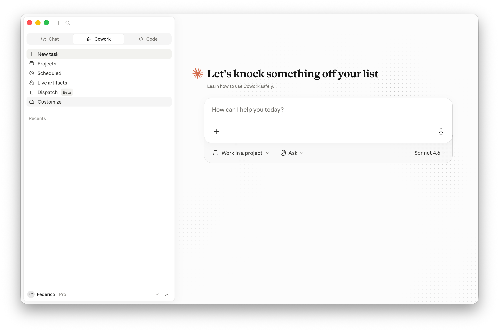
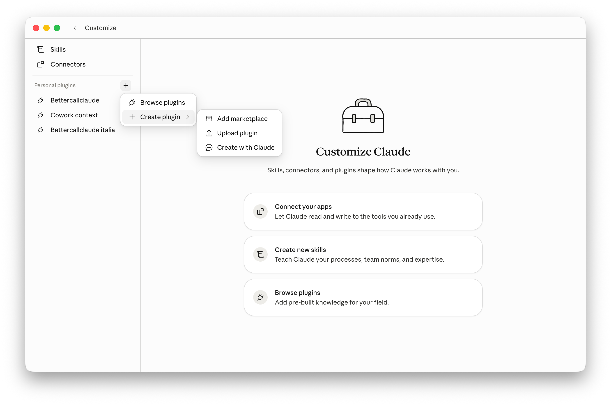
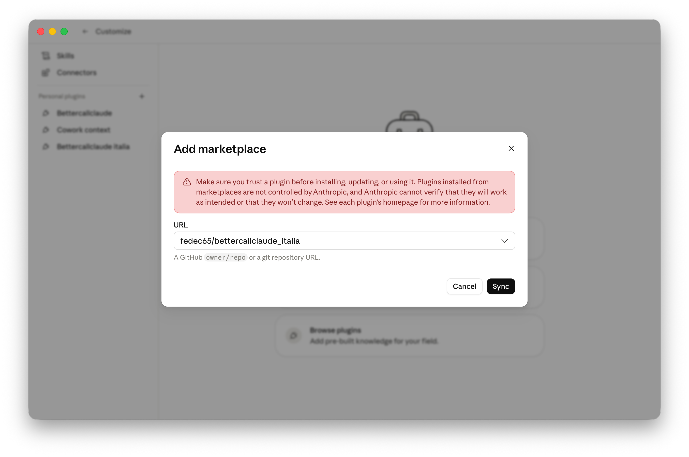
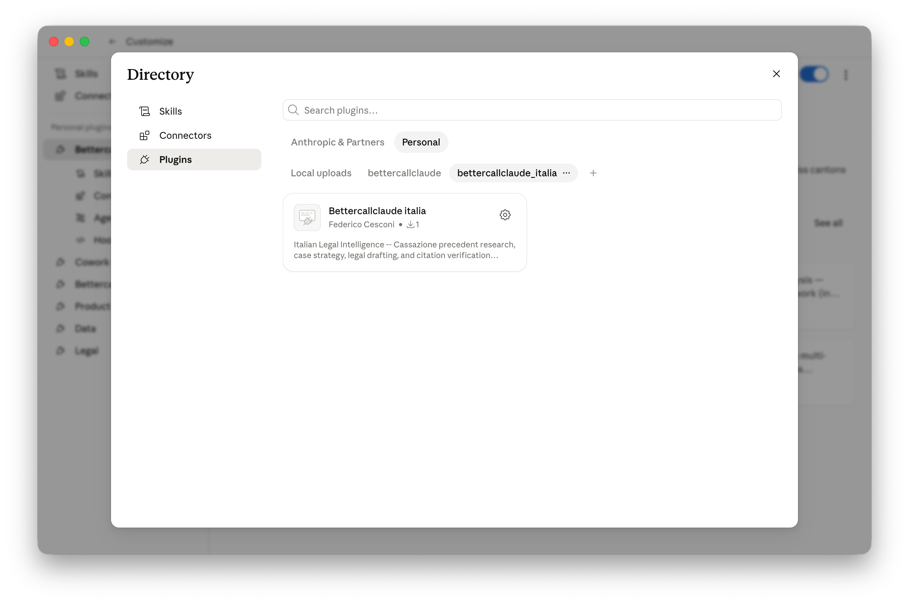
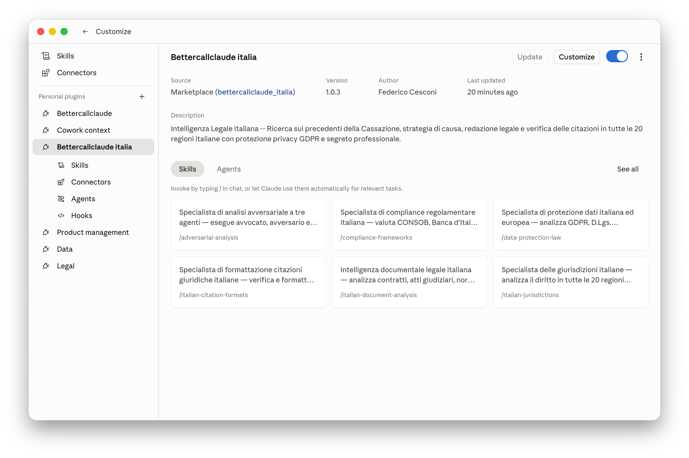
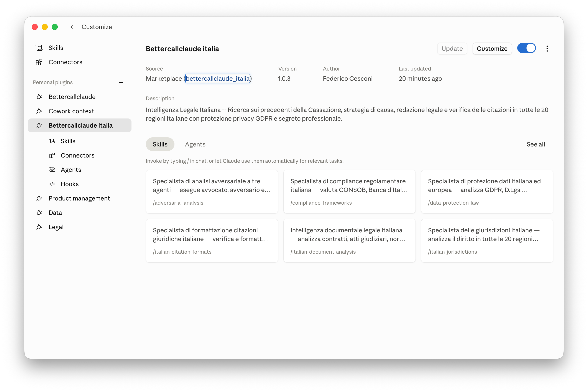
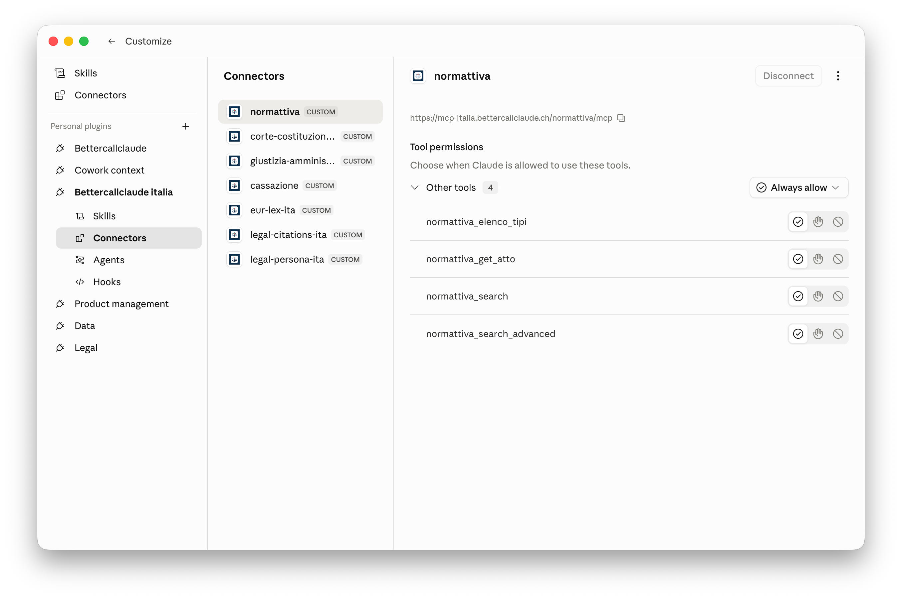
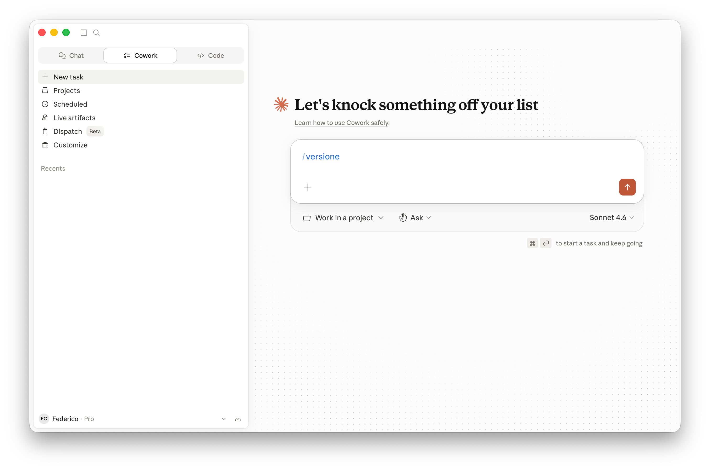
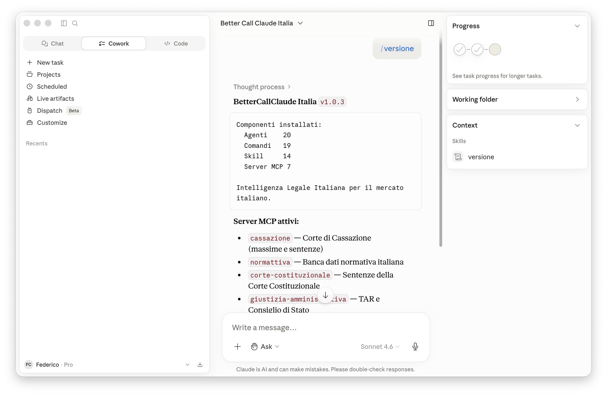
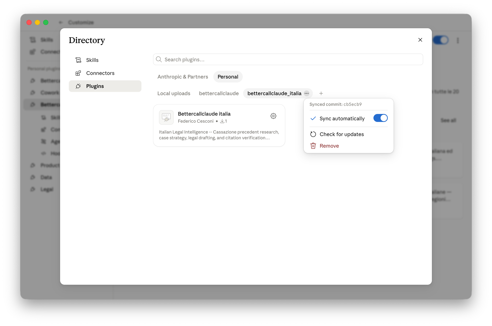

# Guida all'Installazione Passo per Passo

Questa guida ti accompagna nell'installazione di **BetterCallClaude Italia** su Claude Cowork Desktop.

---

## Prerequisiti

- [Claude Cowork Desktop](https://claude.ai) installato e funzionante
- Account Claude attivo (Piano Pro o superiore)

---

## Passo 1: Apri Customize

In Claude Cowork, clicca su **Customize** nella barra laterale sinistra.

---

## Passo 2: Aggiungi Marketplace

Clicca il pulsante **+** accanto a "Personal plugins", poi seleziona **Create plugin** > **Add marketplace**.

---

## Passo 3: Sincronizza il Repository

Inserisci `fedec65/bettercallclaude_italia` nel campo URL e clicca **Sync**.

---

## Passo 4: Installa il Plugin

Il marketplace e' stato aggiunto. Clicca sulla scheda **Bettercallclaude italia** per installarlo.

---

## Passo 5: Configura il Plugin

Una volta installato, clicca sull'icona della **ruota dentata** per accedere alle impostazioni del plugin.

---

## Passo 6: Attiva i Connectors

Nella pagina del plugin, clicca su **Connectors** nella barra laterale. Vedrai i 7 server MCP disponibili:

- **normattiva** -- Banca dati normativa italiana
- **corte-costituzionale** -- Sentenze della Corte Costituzionale
- **giustizia-amministrativa** -- TAR e Consiglio di Stato
- **cassazione** -- Massime e sentenze della Corte di Cassazione
- **eur-lex-ita** -- Atti UE in italiano
- **legal-citations-ita** -- Validazione citazioni giuridiche
- **legal-persona-ita** -- Redazione documenti legali

---

## Passo 7: Dai i Permessi ai Connectors

Per ogni connector, seleziona **Always allow** per autorizzare Claude a utilizzare i tool automaticamente. Questo evita richieste di conferma ad ogni chiamata.

---

## Passo 8: Verifica l'Installazione

Torna in Claude Cowork e digita il comando `/versione` nella chat.

---

## Passo 9: Conferma

Claude Cowork ti mostrera' la versione installata di BetterCallClaude Italia con tutti i componenti e i server MCP disponibili.

---

## Passo 10: Attiva la Sincronizzazione Automatica

Per ricevere gli aggiornamenti del plugin in modo automatico, vai in **Customize** > **Browse plugins** > **Personal** > clicca sui tre puntini (**...**) accanto a **bettercallclaude_italia** e assicurati che il toggle **Sync automatically** sia attivato (blu). In questo modo, ogni volta che viene pubblicata una nuova versione del plugin, Cowork la scarichera' automaticamente senza intervento manuale.

---

## Problemi Comuni

| Problema | Soluzione |
|----------|-----------|
| "Marketplace sync failed" | Verifica di aver inserito correttamente `fedec65/bettercallclaude_italia` |
| I connectors non rispondono | Controlla la connessione internet. I server sono su `mcp-italia.bettercallclaude.ch` |
| Comandi non riconosciuti | Assicurati che il plugin sia attivo (toggle blu nella pagina del plugin) |

---

## Comandi Disponibili

Dopo l'installazione, puoi usare tutti i 19 comandi italiani. Digita `/bettercallclaude-italia:aiuto` per la lista completa.

---

[Torna al README](../README.md)
